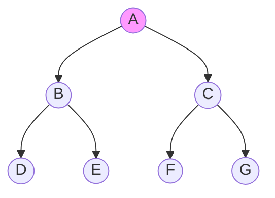
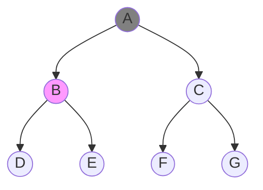
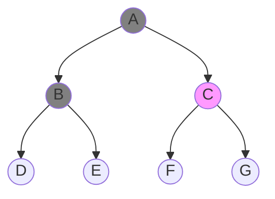
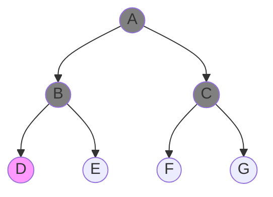
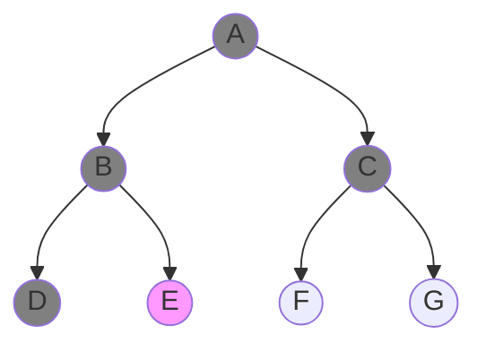
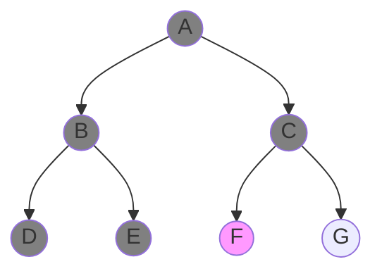
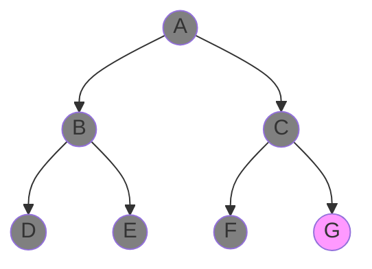
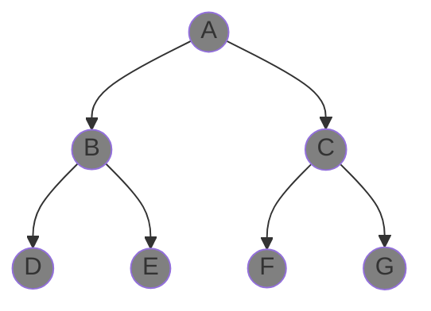

Uninformed or blind search strategies are a class of search algorithms where we only know the start and goal nodes, however we do not have any information about how to traverse the tree. All non-goal nodes look equally good, so we can pick which ever child node first when we are on any particular node and go to other children nodes afterwards. We will search until we find our goal node. The most popular uninformed search strategies are Depth-first search (DFS) and Breadth-first search (BFS). 

# Topics
- [1. Breadth-first search (BFS)](#1-breadth-first-search)
- [2. Depth-first search (DFS)](#2-dreadth-first-search)

## 1. Breadth-first search (BFS)

Breadth-first search (BFS) starts and processes all nodes that are direct neighbours of starting node. Then it processes all direct neighbours of direct neighbours of starting nodes (excluding the ones already processed) and so on. The visualization below shows the BFS algorithm in action.



















```cpp
int main() 
{

}
```
## 2. Depth-first search (DFS)


