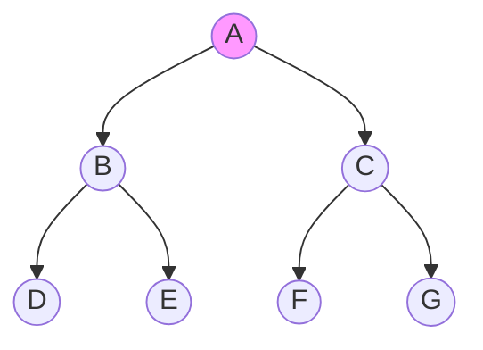
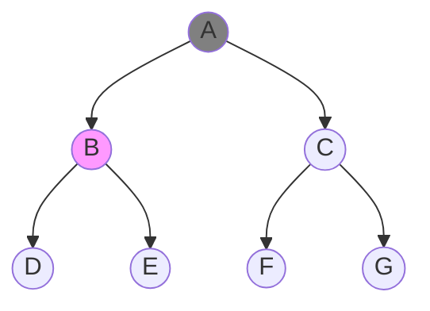
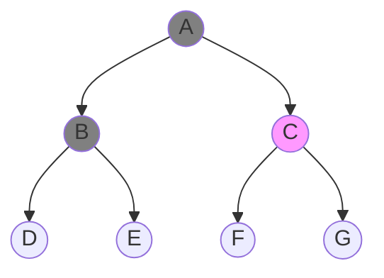
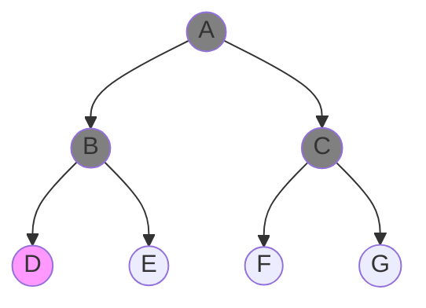
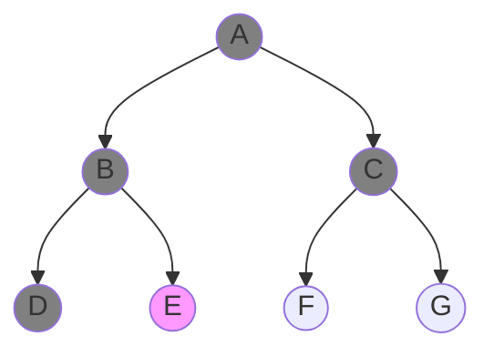
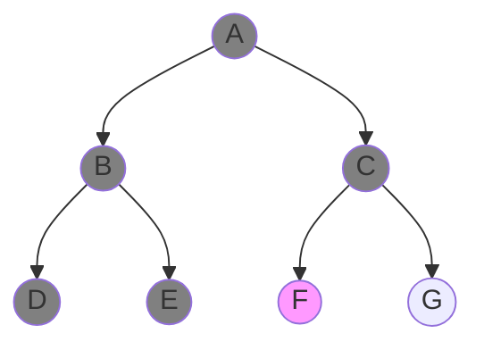
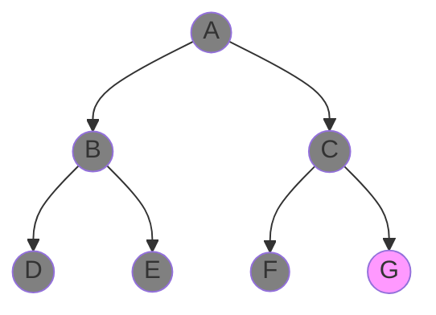
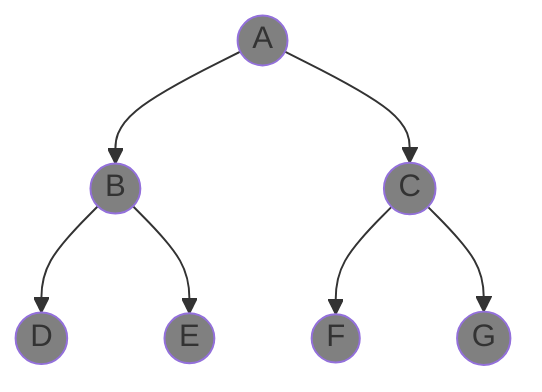

Uninformed or blind search strategies are a class of search algorithms where we only know the start and goal nodes but no information about how to traverse the tree. All non-goal nodes look equally good. The most popular uninformed search strategies are Depth-first search (DFS) and Breadth-first search (BFS). 

# Topics
- [Depth-first search (DFS)](#1-dreadth-first-search)
- [Breadth-first search (BFS)](#2-breadth-first-search)

## Depth-first search

## Breadth-first search

